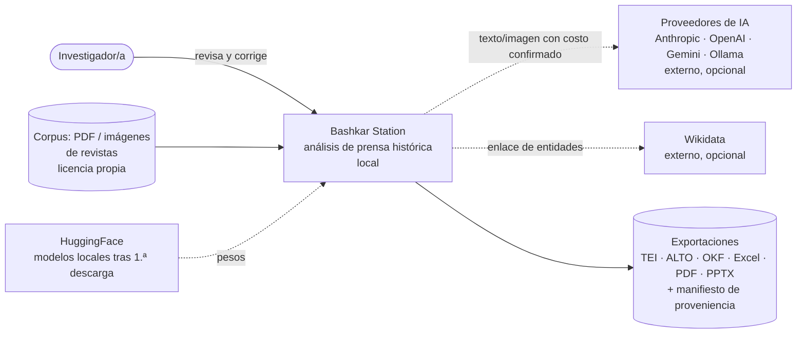
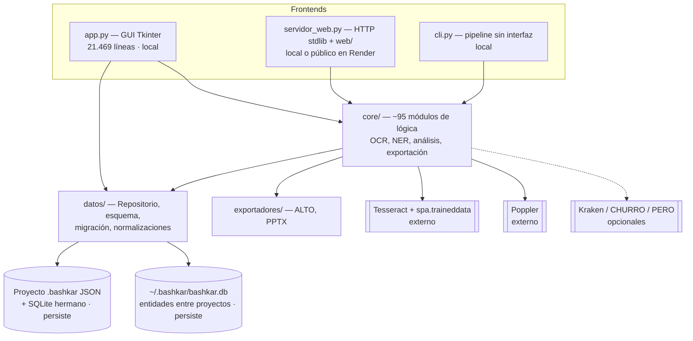
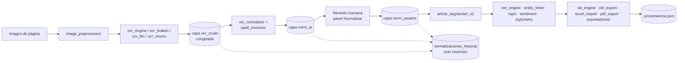
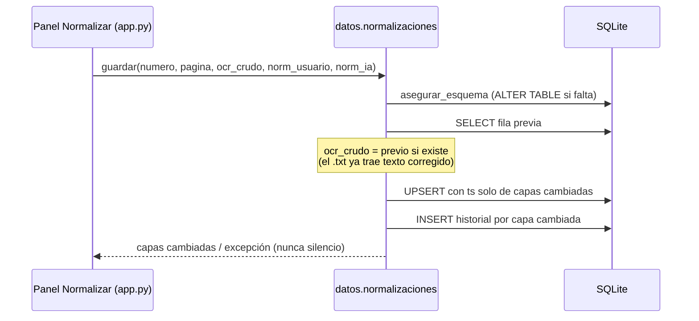

# Arquitectura de Bashkar Station (modelo C4)

Estado al 29-sep-2026, medido sobre el código (no deseado). Los diagramas usan
Mermaid y se ven directamente en GitHub.

Leyenda de cada caja: **[local]** corre en el equipo sin red · **[externo]**
programa o servicio fuera de Python · **[persiste]** escribe archivos que
sobreviven a la sesión.

---

## Nivel 1 — Contexto

El corpus y los modelos **no** se distribuyen con el software; cada uno tiene
su licencia (ver README, sección Licencias).

## Nivel 2 — Contenedores

La GUI y el servidor web comparten `core/` y `core/estado.Estado`. La GUI
todavía hace mucho trabajo propio: ver "Estado de app.py" más abajo.

## Nivel 3 — Componentes (pipeline de texto)

Las tres capas de texto viven en la tabla `normalizaciones`
(`datos/normalizaciones.py`). El OCR crudo no se sobrescribe nunca y cada
cambio deja una fila en `normalizaciones_historial` con autor, hora y commit.

Medición: `core/benchmark_ocr.py` (métricas) y `core/benchmark_regresion.py`
(benchmark formal con línea base, ver `benchmark/README.md`).

## Nivel 4 — Código: `datos/normalizaciones.py`

Es el único módulo con diagrama de código, porque aquí vive la regla
metodológica central (no destruir evidencia):

---

## Estado de app.py

Medido con `ast` el 29-sep-2026:

| Bloque | Líneas |
|---|---:|
| Clase `BashkarApp` (única) | 20.702, 572 métodos |
| Pestaña NER (índice de entidades, canónicas, grafos, revisión) | 8.214 |
| Etiquetador de zonas | 4.254 |
| Panel de asistente IA | 1.992 |
| Resultados y exportación | 1.957 |
| Configuración | 947 |
| Resto de pestañas | < 500 cada una |

44 métodos no usan `self`: son lógica pura alojada en la clase por
comodidad, y son los primeros candidatos a salir.

### Estrategia de extracción

No se reescribe. Cada paso:

1. Elegir un bloque cuya lógica no toque widgets.
2. Escribir tests de contrato contra el comportamiento actual.
3. Moverlo a `core/` o `datos/` con una API pequeña.
4. Dejar en `app.py` un método delgado que delega (adaptador), para no tocar
   los llamadores.
5. Suite completa en verde y commit por bloque.

Hechos:

- `datos/normalizaciones.py` ← `_norm_leer_db` / `_norm_escribir_db`
  (sesión 70). La extracción destapó que el OCR original se perdía.
- `core/servicios_corpus.py` ← conteo de páginas, reconstrucción de metadatos
  del corpus y agrupación por período (sesión 70).

- `core/servicios_exportacion.py` ← configuración y estadísticas de
  METHODS.md (duplicadas en dos sitios, ambas con cifras falsas) y artículos
  TEI. Destapó que el paquete de publicación nunca incluía `corpus.xml`.
- `core/exploradores.exportar_gexf` ← `_can_escribir_gexf` (el GEXF se rompía
  con comillas en un nombre de entidad).
- `core/benchmark_ocr.catalogo_rutas` ← `_bench_catalogo_rutas`.

Tres de las cinco extracciones destaparon un fallo real. Es el argumento
práctico a favor de seguir: la lógica escondida en la GUI no tenía tests.

Siguientes, por orden:

1. Ejecución de rutas del benchmark (`_bench_correr_ruta`) → `core/benchmark_ocr`.
2. Pestaña NER: separar primero lectura/escritura en SQLite (ya existe
   `datos/repositorio.py`), después la vista.
3. Etiquetador de zonas: separar render de PDF y persistencia de zonas.

Meta: `app.py` como punto de composición (construye ventanas y conecta
señales). No hay fecha, pero sí un indicador: la tabla de arriba, regenerada
en cada sesión que extraiga algo.
