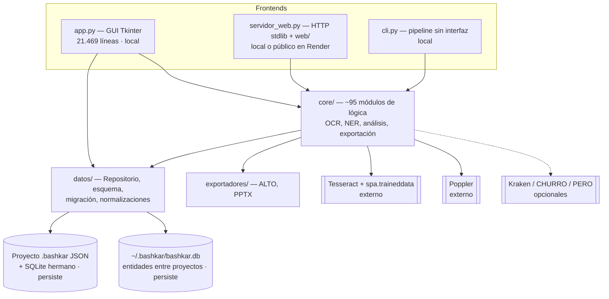
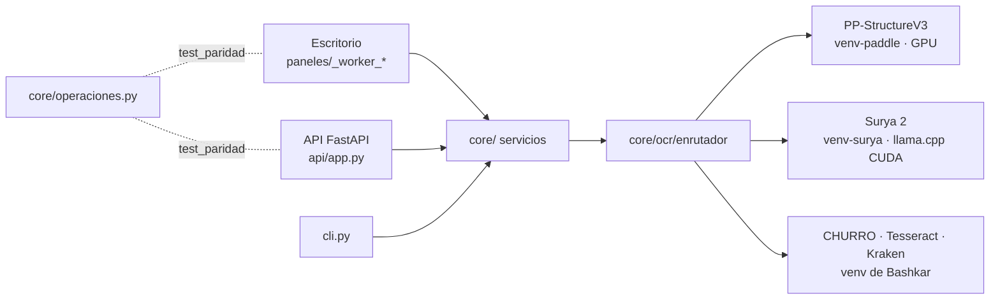
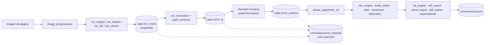
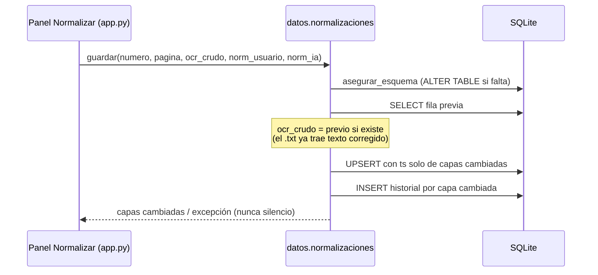

# Arquitectura de Bashkar Station (modelo C4)

Estado al 29-sep-2026, medido sobre el código (no deseado). Los diagramas usan
Mermaid y se ven directamente en GitHub.

Leyenda de cada caja: **[local]** corre en el equipo sin red · **[externo]**
programa o servicio fuera de Python · **[persiste]** escribe archivos que
sobreviven a la sesión.

---

## Nivel 1 — Contexto

El corpus y los modelos **no** se distribuyen con el software; cada uno tiene
su licencia (ver README, sección Licencias).

## Nivel 2 — Contenedores

La GUI y el servidor web comparten `core/` y `core/estado.Estado`. La GUI
todavía hace mucho trabajo propio: ver "Estado de app.py" más abajo.

### Escritorio y API en paridad (sesión 72)

Desde la sesión 72 hay dos interfaces de primera clase, sin prioridad de una
sobre la otra: el escritorio (`app.py` + `paneles/`, aprovecha la GPU local)
y la API (`api/app.py`, FastAPI, pensada para la nube). La regla:

- **La lógica vive en `core/`**; los paneles y las rutas de la API solo la
  llaman. Ejemplos: `core/ocr/servicio.py` (OCR de una página y
  `ocr_metadatos.csv`), `core/servicios_ner.py` (NER de corpus),
  `core/servicios_exportacion.exportar_tei_articulos`.
- **`core/operaciones.py` registra cada operación del escritorio** (cada
  `_worker_*`) con su ruta en la API o `api=None` y el motivo.
  `tests/test_paridad.py` falla si aparece un worker sin registrar o si una
  ruta declarada no existe. Al 6-oct-2026: 25 operaciones, 6 con ruta.

### OCR: enrutador, bloques y segunda opinión

- `ResultadoOCR.bloques`: regiones con `bbox`, tipo, orden de lectura,
  confianza y lecturas alternativas. Se guardan en `<pagina>.bloques.json`
  junto al `.txt`. Motores sin geometría dejan la lista vacía (no se
  inventan coordenadas).
- `core/ocr/enrutador.py` (política en `config/ocr.toml`): texto embebido si
  `calidad_ocr` lo da por bueno; si no, el primario disponible; segunda
  opinión si el resultado es dudoso. `core/ocr/desacuerdo.py` compara y marca
  revisión; **no elige** cuál de los dos acierta. La segunda lectura va a
  `<pagina>.alternativas.json`, nunca a un `.txt` (entraría al corpus).
- Surya y Paddle corren en venvs propios como trabajadores persistentes
  (`core/ocr/externo.py`, protocolo de líneas JSON por stdin/stdout).

## Nivel 3 — Componentes (pipeline de texto)

Las tres capas de texto viven en la tabla `normalizaciones`
(`datos/normalizaciones.py`). El OCR crudo no se sobrescribe nunca y cada
cambio deja una fila en `normalizaciones_historial` con autor, hora y commit.

Medición: `core/benchmark_ocr.py` (métricas) y `core/benchmark_regresion.py`
(benchmark formal con línea base, ver `benchmark/README.md`).

## Nivel 4 — Código: `datos/normalizaciones.py`

Es el único módulo con diagrama de código, porque aquí vive la regla
metodológica central (no destruir evidencia):

---

## Estado de app.py

| | 29-sep-2026 (sesión 70) | 30-sep-2026 (sesión 71) |
|---|---:|---:|
| `app.py` | 21.469 líneas | **6.640 líneas** |
| Métodos en `BashkarApp` (app.py) | 572 | 154 |
| Métodos en `paneles/` | — | 420, en 8 módulos (imports explícitos) |

### Dos capas de separación

1. **Lógica → `core/` y `datos/`** (servicios con tests de contrato):
   `datos/normalizaciones`, `core/servicios_corpus`, `core/servicios_exportacion`,
   `core/servicios_entidades`, `core/ocr` (contrato `MotorOCR` + registro de
   motores), `core/perfil_corpus`, `core/proveniencia`.
2. **Interfaz → `paneles/`** (una pestaña por módulo, como *mixin*):

| Módulo | Pestañas | Métodos |
|---|---|---:|
| `paneles/analisis.py` | Colocaciones, tono, novedad, tópicos, visual, comparativo, segmentación, visualizaciones, dashboard | 95 |
| `paneles/entidades.py` | NER, red, grafo canónico, anotaciones, validación, colaboración, búsqueda semántica | 74 |
| `paneles/etiquetador_zonas.py` | Etiquetador de zonas | 68 |
| `paneles/normalizar.py` | Normalizar y verificación | 48 |
| `paneles/linguistica.py` | Lingüística (concordancias, SVO, morfología…) | 45 |
| `paneles/ocr.py` | OCR, conversor masivo, extracción multimodal, descripción de imágenes | 40 |
| `paneles/resultados.py` | Resultados, exportación, paquete de publicación, reporte, benchmark | 38 |
| `paneles/bitacora.py` | Bitácora de investigación | 12 |

`app.py` conserva la infraestructura: arranque, barra lateral y navegación,
configuración, tema, panel del asistente IA, parámetros, y los métodos que
usan `global`, `nonlocal` o `super()` (moverlos a un mixin cambiaría su
significado).

**Cómo funcionan los paneles.** Los métodos se movieron con copia literal
(`scripts/_herramientas/extraer_panel.py`). Cada panel importa explícitamente
lo que usa: lo compartido con `app.py` vive en `gui_comun.py` (`ST`,
`APP_VERSION`, ayudas) y los colores en `gui_comun.TEMA`, que se lee en cada
uso porque el tema cambia en caliente (`_aplicar_paleta` lo actualiza). Ruff
F821 comprueba los paneles como cualquier otro módulo, y
`tests/test_paneles.py` vigila en ejecución lo que ruff no ve: herencia,
métodos duplicados entre paneles y que ningún color se use sin `TEMA.`.

Un panel no puede importar de `app`: ejecutado como `python app.py`, el módulo
se llama `__main__`, e `import app` crearía una segunda copia con otro `ST`.
Por eso existe `gui_comun.py`.

**Proveniencia de cada página OCR.** El worker de OCR registra en
`ocr_metadatos.csv` el motor que de verdad produjo cada texto (también cuando
fue un respaldo), su versión y la confianza solo si el motor la mide
(`core/ocr/procedencia.py`); Normalizar lo lleva a `normalizaciones`.

**SQLite.** La GUI ya no abre conexiones: todo pasa por `datos/` o por los
motores de `core/` (el último caso, la cola de revisión NER, se movió a
`core/revision_engine`).

Siguientes (lógica que sigue dentro de los paneles), por orden:

1. Worker de OCR de `paneles/ocr.py`: la procedencia ya es fiel, pero cada
   ruta sigue en su propia rama de `if`; unificarlas sobre el registro
   `core.ocr` exige antes un adaptador por lotes para Kraken y Ollama, que hoy
   procesan en paralelo con su propia API.
2. Etiquetador de zonas: separar render de PDF y persistencia de zonas.
3. Los colores de `app.py` siguen siendo globales mutables (los paneles ya
   leen `TEMA`); migrar `app.py` a `TEMA` cerraría el patrón.

Meta: `app.py` como punto de composición (construye ventanas y conecta
señales). No hay fecha, pero sí un indicador: la tabla de arriba, regenerada
en cada sesión que extraiga algo.
